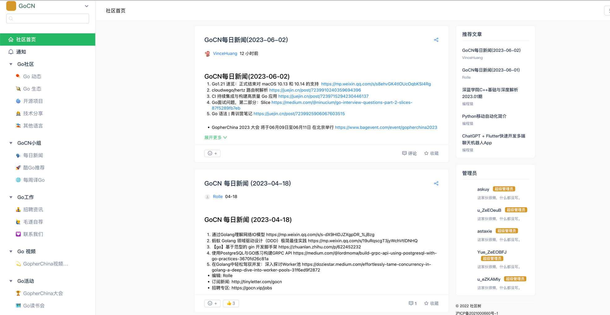

# ecodepost
## 论坛样式

## 支持功能
* 文章
  * 流式布局
  * 卡片布局
  * 列表布局
* 问答
* 专栏
* 友链

## 安装

- For Docker

```bash
# clone ecodepost source code.
git clone https://github.com/ecodepost/ecodepost.git

docker-compose up
```


## 如何启动
### 下载release包
### 创建数据库
```sql
CREATE DATABASE `ecodepost`;
```
### 修改配置
```toml
# mysql 换成你的 ip
# redis 换成你的 ip
```
### 使用指令
```bash
export EGO_DEBUG=true && ./ecodepost --job=install
```
### 初始化数据
```bash
export EGO_DEBUG=true && ./ecodepost --job=init
```
### 启动网站
```bash
export EGO_DEBUG=true && ./ecodepost 
```

### 访问
访问 https://localhost:9002

## todo
* 接口全部变成/api

